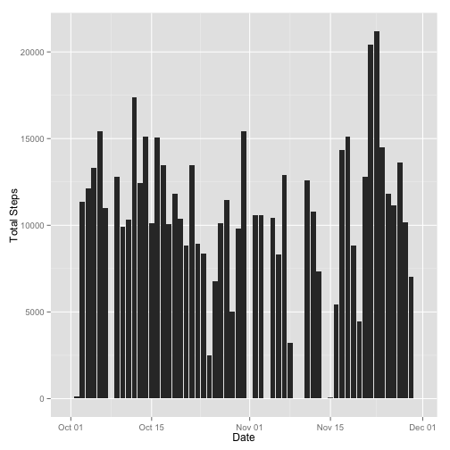
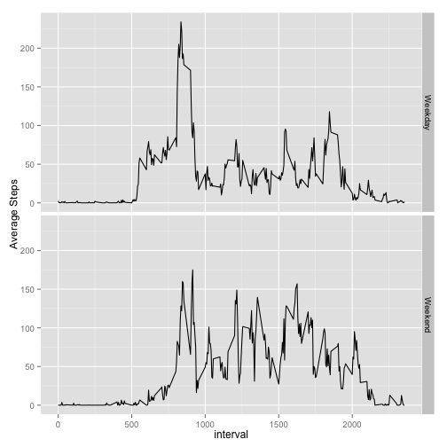

## Loading and preprocessing the data

The activity data we will be looking at was added to our repo on Feb
11, 2014 (commit
[9abcd99566ad027022e4aafbffb5768f9ee11182](https://github.com/charlietanksley/RepData_PeerAssessment1/commit/9abcd99566ad027022e4aafbffb5768f9ee11182)).

The data requires minimal preprocessing: `NA`s are proprly represented
in the data, so the only work we need to do is convert the `date`
field from a String to an actual Date.


```r
data <- read.csv(unz("activity.zip", "activity.csv"))
data$date <- as.Date(data$date, "%Y-%m-%d")
```


## What is mean total number of steps taken per day?

To learn about the total number of steps taken per day, we first need
to aggregate our table so we have one row per day with two columns:
the day and the total number of steps for that day.


```r
stepsPerDay <- aggregate(data$steps, by=list(data$date), FUN=sum, na.rm = TRUE)
names(stepsPerDay) <- c('date', 'steps')
```

With that in hand, we can take a quick look at the pattern with a
histogram of steps per day.


```r
qplot(stepsPerDay$date,
      stepsPerDay$steps,
      geom = "histogram",
      stat = 'identity',
      xlab = 'Date',
      ylab = 'Total Steps')
```

 


```r
average <- round(mean(stepsPerDay$steps), digits = 2)
median <- round(median(stepsPerDay$steps), digits = 2)
```

And since we have a table with steps aggregated by day, we can
calucaulte the average number of steps per day as 9354.23 and the
median number of steps per day as 1.0395 &times; 10<sup>4</sup>.

## What is the average daily activity pattern?

To learn about trends over the course of the day, we can aggregate the
data set on the `interval` (the 5 minute chunk of the day the
recording is for).


```r
stepsPerInterval <- aggregate(data$steps, by=list(data$interval), FUN=mean, na.rm = TRUE)
names(stepsPerInterval) <- c('interval', 'steps')
```

We can see the rise and fall of average steps over the course of
the day by looking at the data on a line chart.


```r
qplot(x = interval, y = steps, data = stepsPerInterval,  geom="line")
```

 

```r
mostActiveInterval <- stepsPerInterval[stepsPerInterval$steps == max(stepsPerInterval$steps, rm.na = TRUE), 1]
```

And we can see that the interval with the most steps is 835.

## Imputing missing values

I am going to opt to replace missing data with the average for that
interval.  The average for the day could work, but since we saw a
clear rising then falling trend in the daily activity pattern, it
seems like the average for the interval makes sense.  But even doing
that there will be cases where the interval always has `NA` values.
So in those cases we should use a `0` so as to remove all `NA`s from
the data.


```r
library('plyr')

## if x (which will be the value of steps for that row) is NA, then use the
## mean of steps for the interval if that is not NA; otherwise use 0.
fn = function(x) ifelse(is.na(x), ifelse(is.na(mean(x)), 0, mean(x)), x)
intervalAvg <- ddply(data, c('interval'), transform, 'plotSteps' = fn(steps))

qplot(date,
      plotSteps,
      data = intervalAvg,
      geom = "histogram",
      stat = 'identity',
      xlab = 'Date',
      ylab = 'Total Steps')
```

 

```r
imputedAverage <- round(mean(intervalAvg$plotSteps), digits = 2)
imputedMedian <- round(median(intervalAvg$plotSteps), digits = 2)
```

The new average is 32.48 and median is 0.
The imputed values do not change the histogram much, but the average
and median drop considerably.  Presumably this is because most of the
`NA` values occured at intervals where the average number of steps was
quite low (there are 2304
rows with `NA` steps and
2304
of those have `0` for the average number of steps for their interval).

## Are there differences in activity patterns between weekdays and weekends?

We can use the `date` field and the `weekdays` function to add a new
`is.weekend` factor column to the data.


```r
withWeekend <- data
is.weekend <- sapply(weekdays(withWeekend$date), function(x) x == 'Saturday' || x == 'Sunday')
withWeekend$is.weekend <- factor(is.weekend)
```

We need to turn that table into a new one that groups on the
`interval` and `is.weekend` columns and averages the `steps` one.


```r
stepsByIntervalWeekend <- aggregate(withWeekend$steps,
                                    by=list(withWeekend$interval,
                                    withWeekend$is.weekend),
                                    FUN=mean,
                                    na.rm = TRUE)
names(stepsByIntervalWeekend) <- c('interval', 'is.weekend', 'steps')
```

Before we plot this it will be nice to convert the `is.weekend` factor
from `TRUE` and `FALSE` to something that will look nicer on the plot
like `Weekend` and `Weekday`.


```r
library(plyr)
stepsByIntervalWeekend$is.weekend <-mapvalues(stepsByIntervalWeekend$is.weekend,
                                              from = c(TRUE, FALSE),
                                              to = c("Weekend", "Weekday"))
```

Now we can plot the data, using facets in `ggplot2` to easily break
the chart into panels.


```r
qplot(interval,
      steps,
      data = stepsByIntervalWeekend,
      geom = "line",
      facets = is.weekend ~ .,
      ylab = 'Average Steps')
```

 

These charts show that on weekdays the activity starts earlier in the
day and then gets a bit calmer during the middle of the day.  While on
weekends the activity starts later but is more constant throughout the
day.
